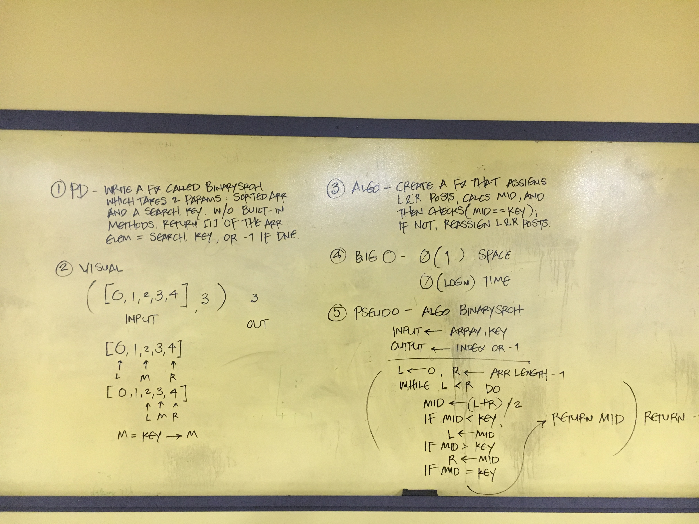

## Challenge

Write a function that runs a binary search on an Int Array, returning the index of the found search key. If the search key was not found, return -1

Since we are starting at the top left of the 2d array, we only need to check for sums of numbers to the right, and below. Each time it finds a sum, if its greater than the most current largest sum, it reassigns the largest sum to that new number. We have to catch instances of if there is no number to the indices to the right or below it, then it skips that procedure.

- 

