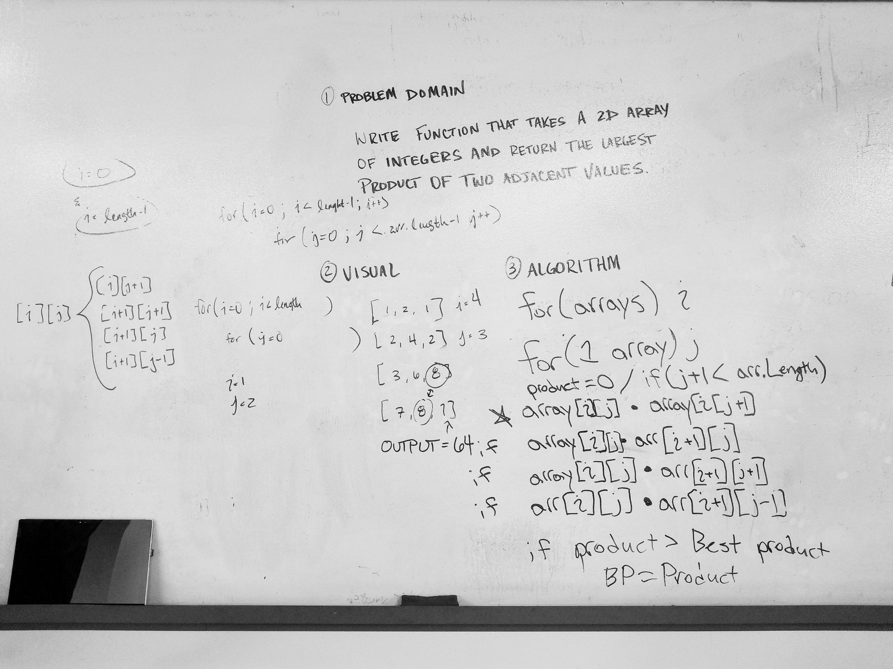

## Challenge
Write a function called LargestProduct which takes in a 2D array, of arbitrary size.
Without utilizing any of the built-in methods available to your language, return the largest product of 2 adjacent values within the 2D array.
Adjacent values might be horizontally, vertically, or diagonally connected.

- 
