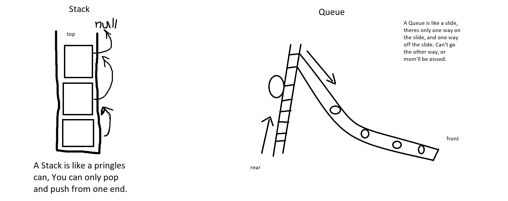

# Overview
A data structure is a format/design for a collection of similar objects. Depending on the data structure, you can navigate, find, and manipulate the Nodes of information inside the Data Structure
- 
The Stack has a top and you manipulate nodes from that reference only. Any time you push or pop you simply reassign the Top to the new node. In a Queue, there is a front and a rear, When adding a node, you affect the rear because that is the only way Nodes enter the Queue. and when you Dequeue you affect the Head, because that is the only way out of the Queue.

A Queue can be implimented like a music playlist, when you hit the button play next. Its not overriding your previous play next, its "queueing" it at the end of the list. Not in front. Just like in queues you don't add nodes to the front, you add them at the end (rear).
A Stack can be implimented like using a pringles can as a container of objects. You can only reach/drop objects from one end, and you can only grab the node/object thats on top.
